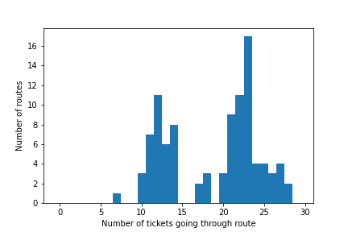

# Analysing Ticket to Ride Maps

## :game_die: Project overview

I love playing board games and the [Ticket to Ride](https://www.daysofwonder.com/tickettoride/en/) series has always been one of my favourites. 

I have often pondered the intricacies of creating a balanced map that avoids too many bottlenecks whilst still providing a challenging puzzle of how most effectively to connect up the destinations on your tickets. I had a go at creating [my own map](https://github.com/Rob217/TicketToRideCountyDurham) and experienced first hand the difficulties of creating a challenging yet fun to play layout.

In this project, I analyse the original USA map of Ticket to Ride and look at the density of tickets that go through different routes between cities. I am interested in seeing whether there are particular routes that have a very high or low probability of being occupied by the end of a game, or whether the probability is relatively evenly spread. 

Eventually, I would like to use this to then create a script which can predict which tickets other players have and where would be the most effective place to block them (not that I usually intentionally block other players...), perhaps even turning this into an AI to play the game. 

## Methods

### Map data

The first step involves gathering the necessary information about the map.
This step is rather laborious, although I automated it as best as I could. 

#### City locations

1. Import an image of the original USA Ticket to Ride map (/data/USA/USA_map.jpg) into Inkscape
2. In a 'Cities' layer, at each city insert a circle, labeled as City:city_name (e.g., City:Chicago)
3. Save as .svg (/data/USA/USA_mpa_with_cities.svg)
4. In /bin/get_cities.ipynb, scan through the .svg text file looking for these cities and saving their names and locations in /data/USA/city_locations.json

#### Routes and tickets

I manually created two .csv files (/data/USA/routes.csv and /data/USA/tickets.csv) listing the routes between each pair of cities and the destination tickets (which cities they connect and the points awarded). 
 

### Shortest path between citites

Once I have the information about the cities, their locations, and the routes between them, it is possible to calculate the shortest possible path between every pair of cities. This can be done efficiently using [Dijkstra's algorithm](https://en.wikipedia.org/wiki/Dijkstra%27s_algorithm) (see /bin/analyse_network.ipynb).

### Number of tickets going through each route

For every route connecting two adjacent cities, it is straight forward (using the shortest path results) to calculate the shortest possible path connecting two destinations on a ticket that goes through that given route. For example, if dest_A and dest_B are the two destination cities, then the shortest path connecting dest_A and dest_B that also goes through the route connecting city_1 and city_2 is the sum of the shortest path from dest_A to city_1, the shortest path from city_2 to dest_B, and the distance between city_A and city_B. Of course it might be the other way around, means the shortest path for each route for each ticket can be calculated in linear time in the number of routes and tickets.

## Results

### n shortest paths

There are many ways that we could estimate the probability that any given route will be occupied. This method is low in complexity and should give us an approximate idea of the geographical spread of tickets in the game. 

For each ticket, let us assume that the n shortest paths between the two destinations are equally likely to be taken, and the rest have zero probability. For each route between adjacent cities, we can then sum the number of tickets for which that route makes up one of the n shortest paths. 

#### n = 1

If we just include the shortest path, then unsurprisingly most of the routes only take part in a small number of tickets (there are 30 tickets in the original base game). Many routes don't even take part in any of the shortest paths (the lightest blue routes in the heat map). This limitation is clearly too simplistic and in no real game will players only ever go the absolute shortest path between destinations.

#### n = 5

Increasing the number so that we now include routes which are in one of the five shortest paths between each pair of destinations, there is now a greater variety in the number of tickets any individual route can contribute to. At one extreme, the route between Miami and New Orleans in the South East corner contributes to only a single ticket (Los Angeles -> Miami), while the route between Saint Louis and Chicago (the bright pink route in the middle) contributes to 21 different tickets. 

#### n = 10

Increasing the number of shortest paths even further starts to reveal a clear distinction between two categories of routes:
1. routes around the edge which take part in relatively few tickets (with Miami -> New Orleans again the smallest contributing to just 7 tickets)
2. routes in the center which take part in many tickets (there is a peak of 17 routes that contribute to 23 tickets)

## Conclusions

Having played this map many times I could have predicted that the long routes around the edge are relatively unused while those at the center are much more likely to be occupied. However, it is interesting to see that the probability is greatest in the small area around Oklahoma City, Little Rock, Kansas City, Saint Louis, and Chicago.

It is an interesting question how best to use this information. 

- Do you choose tickets that go through regions of high occupation, since you have a good chance of drawing more tickets that go through those same regions?
- Do you instead choose tickets along unoccupied routes, such as down to Miami, knowing the competition for those routes will likely be less?
- Do you build on the short high occupation routes at the beginning of the game, regardless of where you tickets go, both to block others and to keep your options open for later in the game?

## Future plans

This analysis so far is quite simplistic and there are many ways that it could be improved or expanded. For example:

- Rather than just counting the n shortest paths, the paths could be weighted proportionally to how short they are relative to the shortest path (the challenge here is how to weight the paths appropriately for both short and long tickets).
- This was done for the original map and original tickets with 5 players; there are many more maps, different ticket sets, and different player counts available. It would be interesting to do a more detailed analysis of all of these variables. For example, with the [1910 expansion](https://www.daysofwonder.com/tickettoride/en/usa/) to the USA map which provides many more tickets, does the increase in tickets smooth out the distribution of route probability, or is there still the difference in density between the center and the edges of the map?
- If we can infer a properly normalised probability that given a particular ticket you would build in a particular route, then using Bayes' theorem you could infer, given that a player has built on a certain set of routes, which tickets they may or may not they are likely to have.

## LICENCE
[Licence](https://github.com/Rob217/TicketToRideAnalysis/blob/master/LICENCE)

I do not own the original Ticket to Ride artwork or game information. They are [(C) Days of Wonder](https://www.daysofwonder.com/en/about/terms/). 
